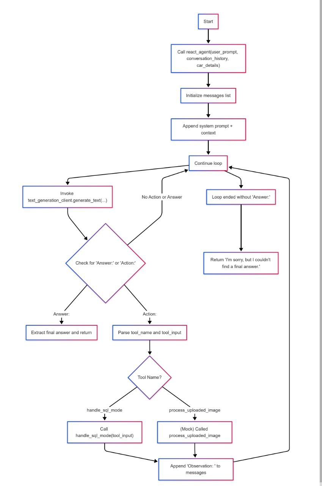
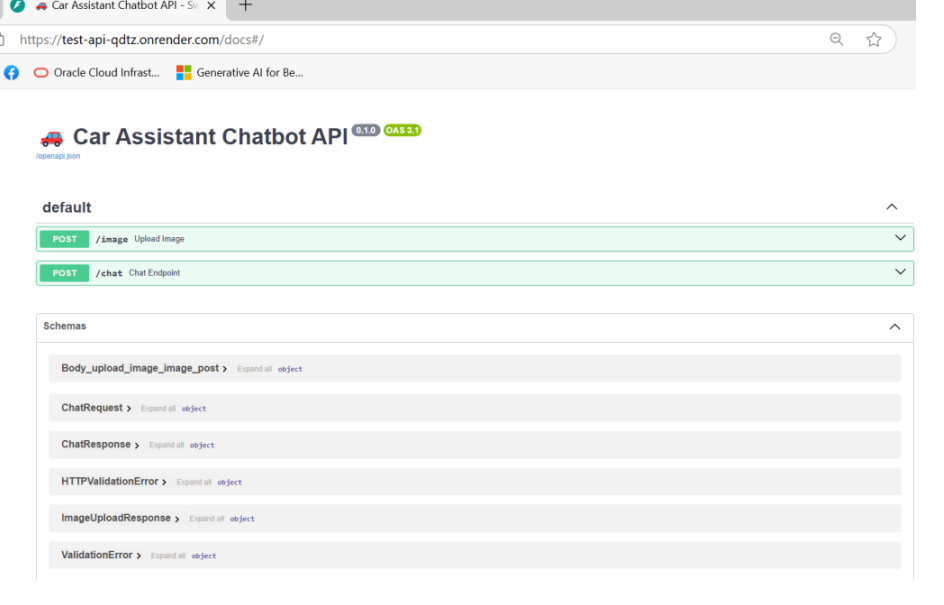
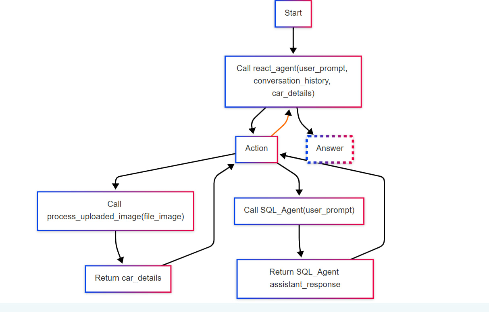
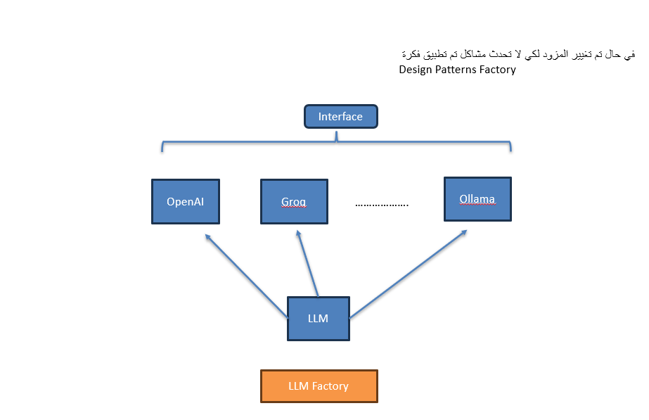

# 🚀 ChatBot AI  

# 1. Introduction 
This document provides a detailed overview of the enhancements and structure of a multicomponent chatbot system that integrates text generation, image processing (computer vision), 
and SQL query handling. The system uses a ReAct-based approach (Reasoning + Acting) to process 
user requests, generate suitable responses, and optionally handle images and SQL queries.


---

# 2. System Components

   ## 2.1 - ChatbotController
   - Central class that orchestrates interactions between different modules.

   - Maintains in-memory conversation history and decides when to invoke SQL operations or image-processing tasks.

   - Utilizes Large Language Model (LLM) prompts to generate context-relevant responses following the ReAct pattern.
   ## 2.2 - Routes
   - **chat.py**
      - Provides the /chat endpoint to handle user requests.
      - Accepts session_id, user_id, user_query, an optional conversation_history, and car_details.
      - Delegates response generation or SQL query handling to ChatbotController.
   - **image.py**
      - Offers the /image endpoint for file uploads (JPG, JPEG, PNG).
      - Validates file types, reads file contents in memory, and uses ChatbotController to extract details via vision processing.
   ## 2.3 - Models
   - **ChatRequest**
      - Encapsulates user inputs such as session_id, user_id, user_query, optional conversation_history, and car_details.
   - **ChatResponse**
      - Contains the chatbot’s generated response text.
   - **ImageUploadResponse**
      - Holds information extracted from the uploaded image.
---
# 3. Technical Highlights
   ## **3.1 - ReAct Methodology**
   * The chatbot employs a step-by-step reasoning approach to interpret and respond to user prompts:
      - **Thought**: Analyze the prompt internally.
      -  **Action**: Execute an action, such as calling a tool (SQL or image processing).
      - **Observation**:: Incorporate the tool’s output into subsequent reasoning steps
      - **Answer**: Provide the final response.

        

   ## **3.2 In-Memory Conversation Management**
   - The system tracks conversations by (session_id, user_id) pairs, allowing for multiple sessions concurrently.

   - Facilitates easy retrieval and updating of conversation context to deliver personalized context-aware interactions.
   
   ## **3.3 Modular Design**
   - Separating functionalities into distinct route files (chat.py and image.py) ensures clarity and maintainability

   - The ChatbotController coordinates logic, while specialized controllers (e.g., SQL_AgentController) handle domain-specific tasks.

   ## **4. Error Handling & Logging**
   - Thorough logging of exceptions and error details ensures operational visibility.

   - The system raises meaningful HTTP exceptions, aiding in rapid debugging and 
transparent communication with the front end

   ## **5. Deployment on Render**
   - The service is currently hosted on Render at 
   **[Deployment Link](https://test-api-qdtz.onrender.com/)**  
   - Render offers convenient deployment workflows, automatic scaling, and continuous integration capabilities

     

---
# 4. Benefits of the Updated System
   ## **4.1 - Readability & Maintainability**
   - The code now uses English docstrings and method signatures, making it more 
approachable for broader teams.
   - Modular controllers with explicit responsibilities facilitate easier updates and 
feature expansions.

   ## **4.2 - Scalable Architecture**
   - Suited for parallel handling of text-based user queries, SQL queries, and image 
analysis
   - Open for future extensions, like integrating additional AI tools or new backends for 
text generation
   ## **4.3 - Enhanced User Experience**
   - The ReAct approach ensures deeper context understanding, enabling the chatbot to 
reason effectively about user requests.
   - Direct processing of images (extracting car details, for example) enriches the scope 
of user interactions.

   ## **4.4 - Consistent Error Response**
   - Unified error handling across text generation, image processing, and SQL 
operations reduces uncertainty and aids in debugging.

   ## **4.5 - Centralized Conversation Logic**
   - By storing and retrieving conversation data in a single place (conversation_store), 
the system can easily maintain continuity across multiple user turns.
---
# 5. Example Workflow

   ## **5.1 - User Sends a Chat Request**
   - A POST to /chat with session_id, user_id, and user_query.
   - The controller retrieves past conversation data (if any) and passes it to the LLM.
   - A response is generated, appended to the conversation history, and returned as 
ChatResponse.

   ## **5.2 - User Uploads an Image**
   - A POST to /image with a JPG, JPEG, or PNG file
   - The file is read in memory, validated for type, then processed by the vision client in 
ChatbotController
   - Extracted details are returned in ImageUploadResponse.
   ## **5.3 - ReAct Decision-Making**
   - The chatbot identifies whether it needs to invoke a special “tool” (e.g., SQL, image 
processing) by analyzing the user’s prompt.
   - If an SQL query is needed, SQL_AgentController runs the query, returns results, 
which then feed back into the conversation.
  


---
### ⚡ LLM Factory  
**[LLM Store](./src/stores/llm)**  
  

---
## 📌 Requirements  

- **Python 3.10 or later**  

### 🔧 Install Python using MiniConda  

1. Download and install **MiniConda** from [here](https://docs.anaconda.com/free/miniconda/#quick-command-line-install).  
2. Create a new environment:  
   ```bash
   conda create -n chatbot-env python=3.10
   ```
3. Activate the environment:  
   ```bash
   conda activate chatbot-env
   ```

---

## 🔧 Installation  

### Install Project:

```bash
git clone http://git.improeon.com/syr-mentors/ai-car-recommendation-chatbot/acrc-chatbot.git
```

### 📦 Install Dependencies  
Run the following command to install the required packages:  
```bash
pip install -r src/requirements.txt
```

### ⚙️ Set Up Environment Variables  
Copy the example `.env` file:  
```bash
cp .env.example .env
```
Then, update the `.env` file with your credentials.

---

## 🔑 Environment Variables  

| Variable               | Description |
|------------------------|-------------|
| `GENERATION_BACKEND`   | Text generation provider (e.g., `OPENAI`, `GROQ`). |
| `VISION_BACKEND`       | Vision processing provider (e.g., `GROQ`). |
| `EMBEDDING_BACKEND`    | Text embedding provider (e.g., `OPENAI`). |
| `GENERATION_MODEL_ID`  | Model for text generation (e.g., `llama-3.3-70b-versatile`). |
| `VISION_MODEL_ID`      | Model for image processing (e.g., `llama-3.2-90b-vision-preview`). |
| `EMBEDDING_MODEL_ID`   | Model for text embedding (e.g., `text-embedding-ada-002`). |
| `VECTOR_DB_BACKEND`    | Vector database provider (e.g., `CHROMA`). |
| `VECTOR_DB_PATH`       | Storage path for vector database. |
| `DATASET`              | Path to CSV dataset (e.g., `data_cars_price.csv`). |
| `DATABASE_SQL`         | Path to SQL database (e.g., `data_cars_price.db`). |
| `COLLECTION_NAME`      | Collection name in vector DB. |
| `OPENAI_API_KEY`       | OpenAI API key. |
| `GROQ_API_KEY`         | Groq API key. |
| `INPUT_DAFAULT_MAX_CHARACTERS` | Maximum input characters (default: `1024`). |
| `GENERATION_DAFAULT_MAX_TOKENS` | Maximum tokens for generation (default: `1000`). |
| `GENERATION_DAFAULT_TEMPERATURE` | Temperature setting for response randomness (default: `0.0`). |

---

## 🔑 API Key Setup  

- **Generate a Groq API Key**: [Get your Groq API key](https://groq.com/#elementor-action%3Aaction%3Dpopup%3Aopen%26settings%3DeyJpZCI6IjM0MDUiLCJ0b2dnbGUiOmZhbHNlfQ%3D%3D).  
- **Generate an OpenAI API Key**: [Get your OpenAI API key](https://platform.openai.com).  

---

## 🎉 Running the Application  

Once everything is set up, run the chatbot:  
```bash
uvicorn main:app --reload --host 0.0.0.0 --port 5000
```

---

## 📌 Notes  

- **Modify the `.env` file** to match your API configurations and models.  
- **Ensure all dependencies are installed** before running the application.  
- **The chatbot supports both SQL interaction and RAG-based retrieval**.  


# Conclusion

By adopting the ReAct methodology, refactoring the chatbot structure, and deploying on Render, 
we achieve a powerful, versatile, and maintainable system. The chatbot can handle text-based 
queries, image processing, and SQL operations, all within an easily extensible and developer friendly framework


