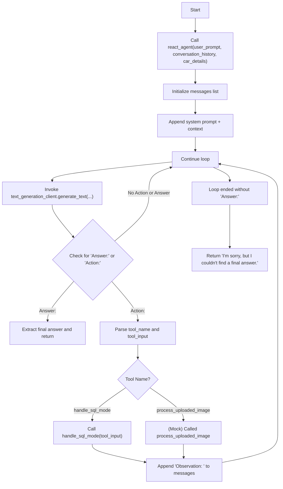
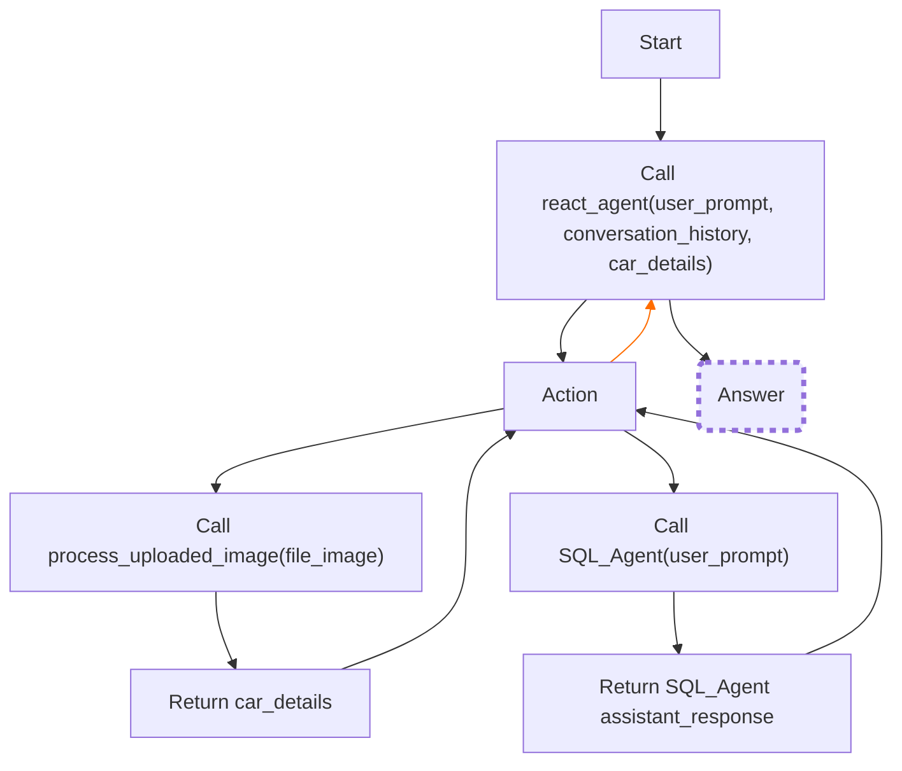

# ReAct Graph

```mermaid
flowchart TD
%% ReAct Agent Loop
    KK[Start]
    KK--> K["Call react_agent(user_prompt, conversation_history, car_details)"]
    K --> L["Initialize messages list"]
    L --> M["Append system prompt + context"]
    M --> N["For loop (max 3 iterations)"]
    N --> O["Invoke text_generation_client.generate_text(...)"]
    O --> P{"Check for 'Answer:' or 'Action:'"}
    P -- "Answer:" --> Q["Extract final answer and return"]
    P -- "Action:" --> R["Parse tool_name and tool_input"]
    R --> S{"Tool Name?"}
    S -- "handle_sql_mode" --> T["Call handle_sql_mode(tool_input)"]

    S -- "process_uploaded_image" --> U["(Mock) Called process_uploaded_image"]
 
    T & U --> V["Append 'Observation: <result>' to messages"]
    V --> N["Continue loop"]
    P -- "No Action or Answer" --> N
    N --> W["Loop ended without 'Answer:'"]
    W --> X["Return 'I'm sorry, but I couldn't find a final answer.'"]

```
# 
# ChatBot Graph

```mermaid

    flowchart TD
        A["Start"] --> V["Call react_agent(user_prompt, conversation_history, car_details)"]
        V --> BB["Action"] & O["Answer"]
        V ~~~ O
        BB --> C["Call process_uploaded_image(file_image)"] & H["Call SQL_Agent(user_prompt)"] & V
        C --> F["Return car_details"]
        H --> J["Return SQL_Agent assistant_response"]
        J --> BB
        F --> BB

        O@{ shape: event}
        style O stroke-width:4px,stroke-dasharray: 5
        linkStyle 6 stroke:#FF6D00,fill:none

```